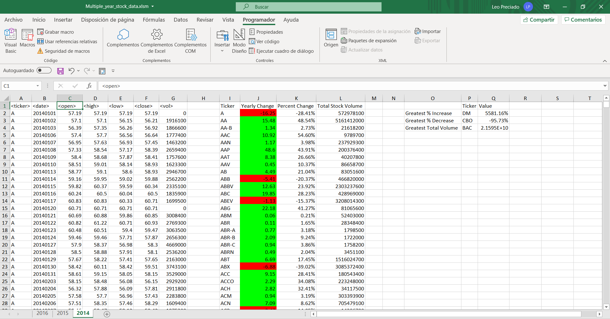
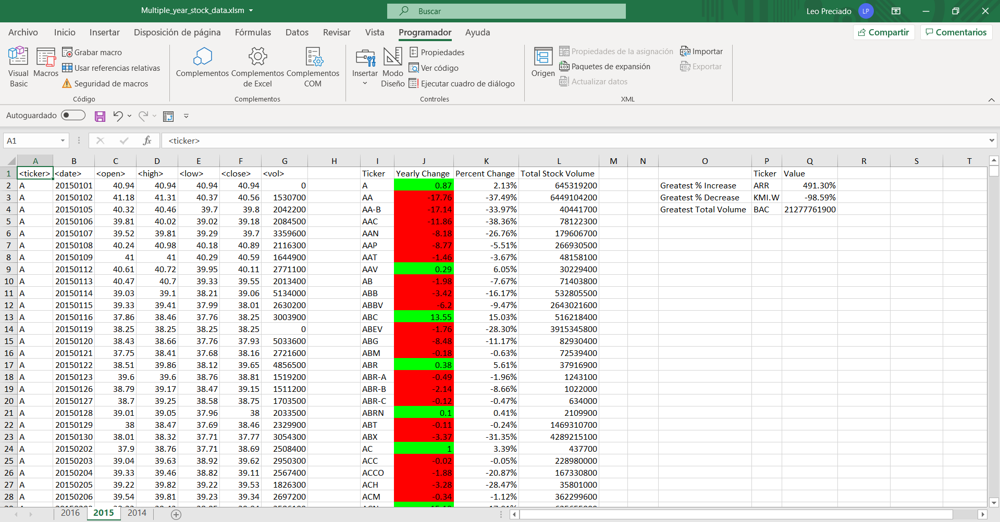
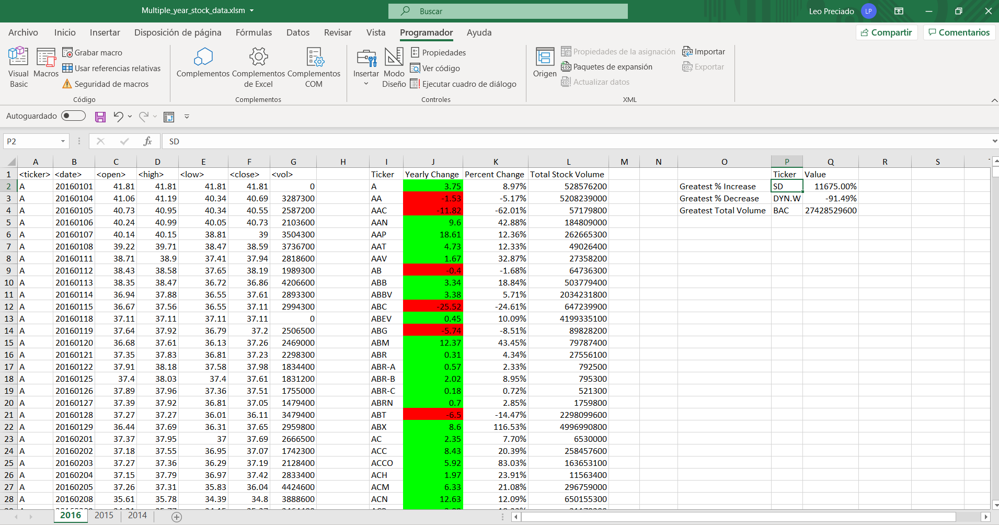

# VBA-challenge
## Objective
This challenge makes use of VBA scripting to analyze real stock market data, it allows to group the tickers and get relevant info such as **Yearly and Percentage change**, **Total stock volume** and additional info such as **The ticker's Greatest percentage increase and decrease**, and the **ticker with the Greatest total volume** per year. 

## Instructions
### Option 1 (Run from scratch).
  1. Open the `Multiple_year_stock_data.xlsx` file
  2. Go to `Developer->Visual Basic` option
  3. Import the `WallStreet.bas` or the `WallStreet_bonus.bas` scripts to your work space
  4.  Press `F5` to run the script

### Option 2 (Run the macro embedded in the file).
  1. Open the `Multiple_year_stock_data.xlsm` file
  2. Go to `Developer->Visual Basic` option
  4.  Press `F5` to run the script

## Contents
The repository contains the following files:

|File|Type|Description|
|---|---|---|
|`WallStreet.bas`|VBA Script|This script covers the first part of the VBA Challenge|
|`WallStreet_bonus.bas`|VBA Script|This script covers the firta part and the bonus of the VBA Challenge|
|`Multiple_year_stock_data.xlsm`|Excel file with macros|This file contains the data source with the embedded macros and the scripts already applied|
|`Multiple_year_stock_data.xlsx`|Excel file|This file contains the data source which the scripts could be applied from scratch (Note: The VBA scripts needs to be imported)|
|`screenshots`|Directory|Contains the screenshots with the script output applied to the source file|

## Screenshots
### Year 2014

### Year 2015

### Year 2016
